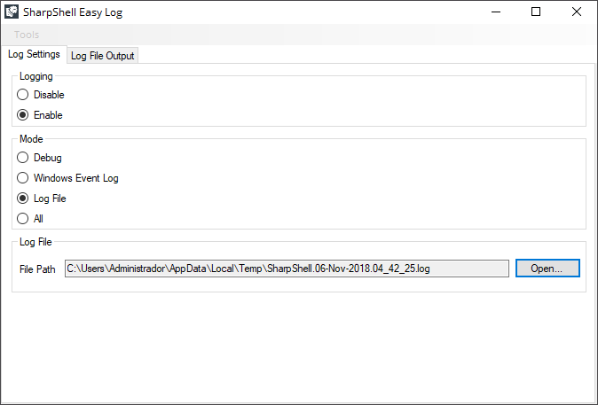
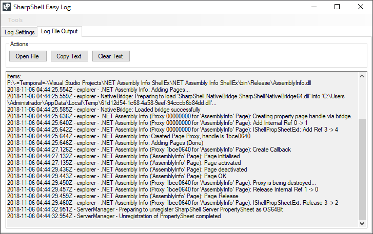
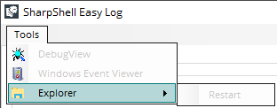

# **SharpShell Easy Log**

**SharpShell Easy Log** is a simple GUI to make file logging easier with **SharpShell**. It wraps the **SharpShell**'s logging functionalities documented )

You can visit and download **SharpShell** from .

## Preview

